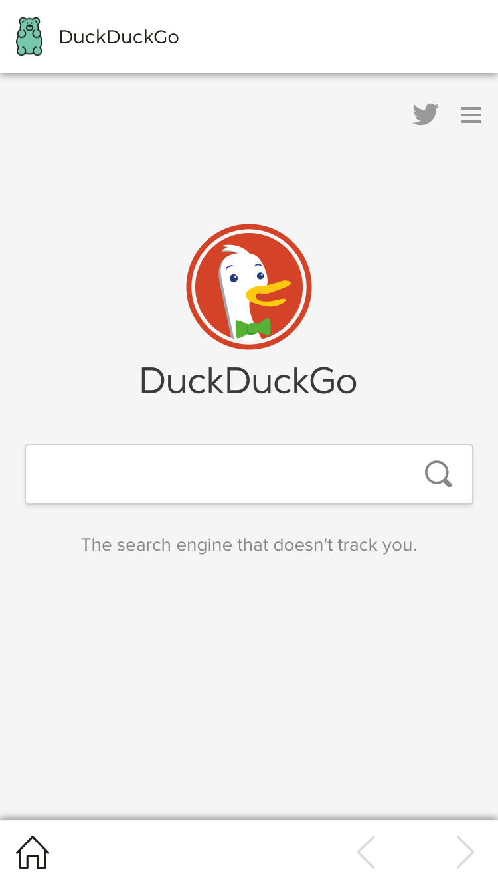

	
	 
  <strong>Gummybear Browser</strong>

 

  
  
  

 

  
  
  

 

  Built with ❤︎ by <a href="tiaan.beer">Tiaan</a> and <a href="https://github.com/tiaanduplessis/gummybear-browser/graphs/contributors">contributors</a>

<h2>Table of Contents</h2>

  
Table of Contents

	<li><a href="#about">About</a></li>

## About

A simple little browser build with [React Native](https://facebook.github.io/react-native/) and [Expo](http://expo.io/)

	

